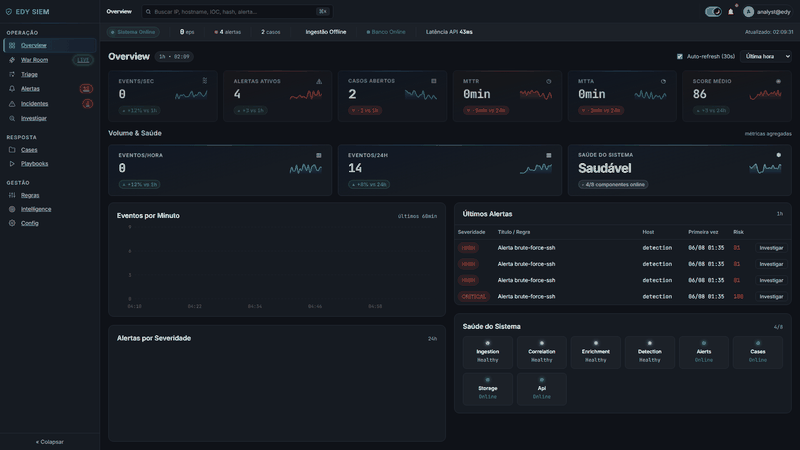
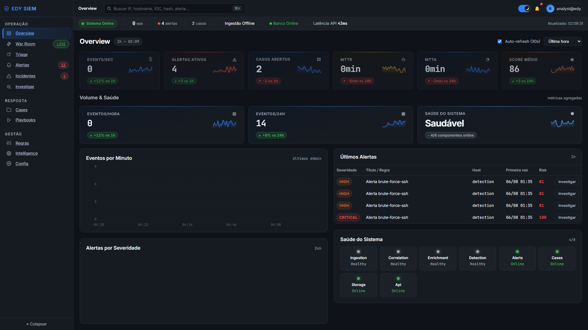
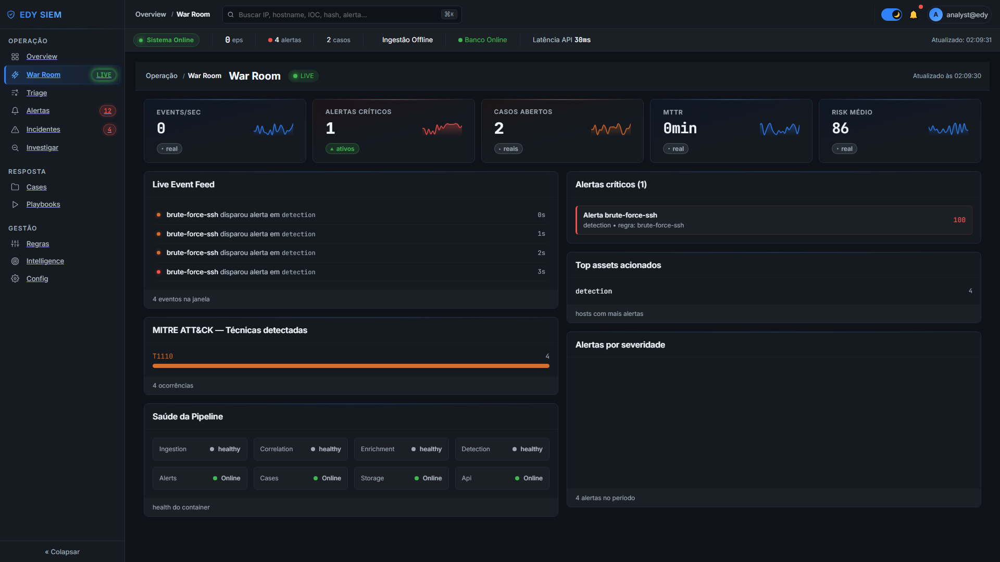
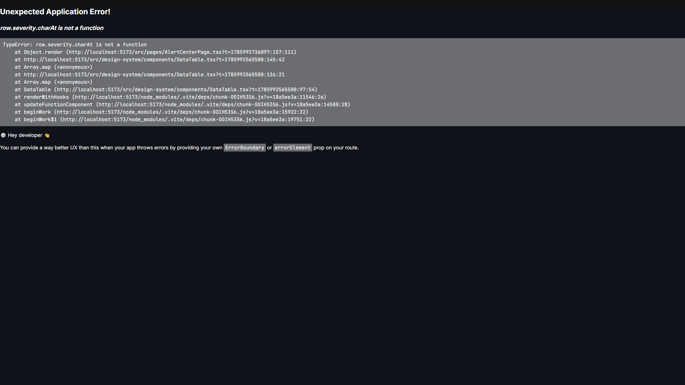
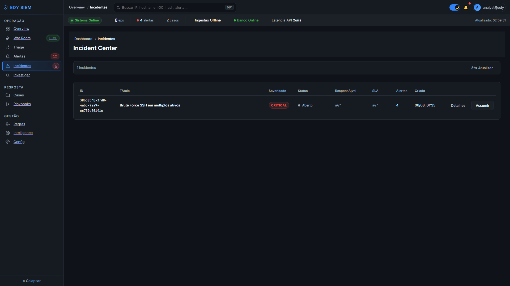
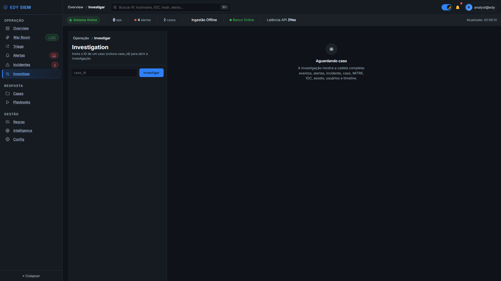
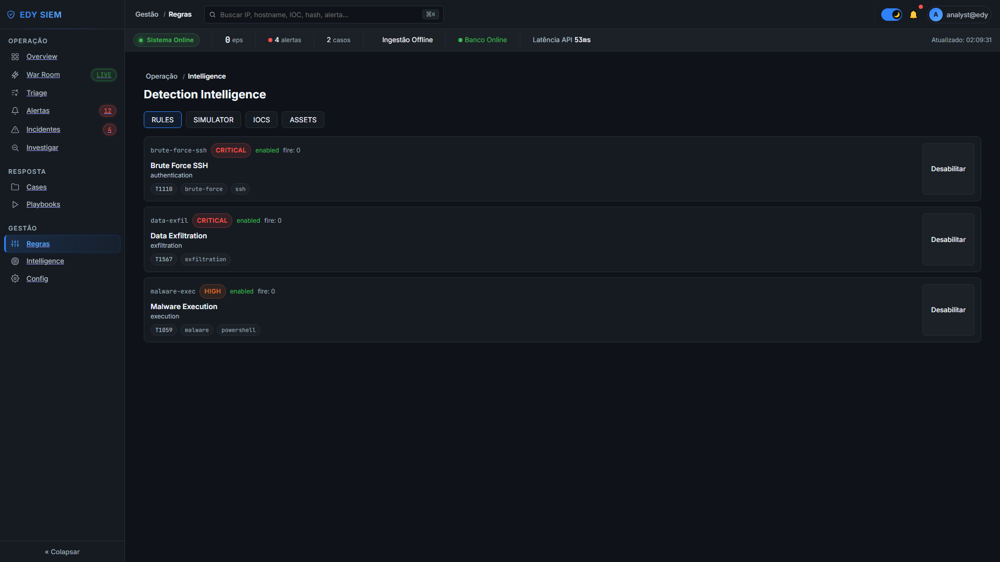
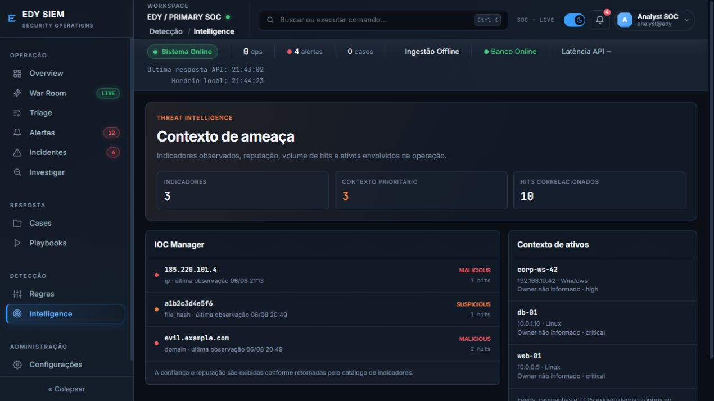
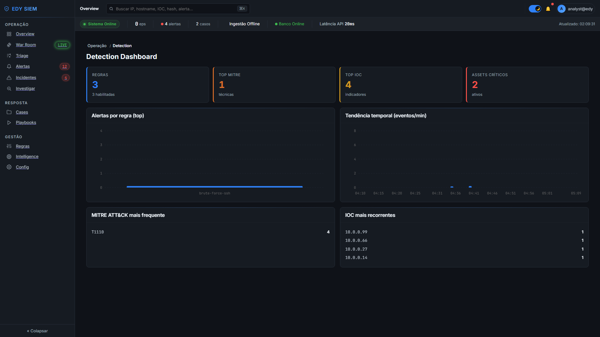

<p align="center">
  
</p>

<p align="center">
  <a href="https://github.com/EDY075/EDYSIEM/actions/workflows/ci.yml"></a>
  
  
  
  
  
  
  
  
</p>

<p align="center">
  <strong>Open-source SIEM and SOC operations platform with detection engineering, incident response, investigation workflows, and threat intelligence.</strong>
</p>

<p align="center">
  <a href="#quick-start">Quick start</a> ·
  <a href="#product-tour">Product tour</a> ·
  <a href="#architecture">Architecture</a> ·
  <a href="docs/README.md">Documentation</a>
</p>



## Product tour

<table>
  <tr>
    <td width="50%"><strong>Dashboard</strong><br></td>
    <td width="50%"><strong>War Room</strong><br></td>
  </tr>
  <tr>
    <td><strong>Alert Center</strong><br></td>
    <td><strong>Incidents</strong><br></td>
  </tr>
  <tr>
    <td><strong>Investigation</strong><br></td>
    <td><strong>Rules</strong><br></td>
  </tr>
  <tr>
    <td><strong>IOC and Assets</strong><br></td>
    <td><strong>Detection Dashboard</strong><br></td>
  </tr>
</table>

## Overview

EDY SIEM turns telemetry into an operational SOC workflow. The Python backend
persists the detection lifecycle, while the React interface gives analysts a
focused workspace for triage, response, investigation, rules, and intelligence.

**Operational flow:** Event → Rule → Alert → Incident → Case → Investigation.

| Area | What it supports |
| --- | --- |
| Operations | Dashboard, War Room, Alert Center, incidents, cases, and playbooks |
| Detection engineering | Rules, simulator, MITRE context, and detection metrics |
| Threat intelligence | IOC Manager and asset context connected to SOC data |
| Platform | FastAPI v1 contracts, SQLite persistence, typed Python, and a React/Vite UI |

## Quick start

Requirements: Python 3.12+ and Node.js 18+.

```bash
python -m pip install -e ".[dev,api]"
cd frontend && npm ci && cd ..
python run.py
```

The single command applies migrations, starts backend and frontend, seeds safe
demonstration data, and opens the UI. Use `--no-seed` or `--no-open` when needed.

| Service | URL |
| --- | --- |
| SOC workspace | http://localhost:5173 |
| Health check | http://127.0.0.1:8080/api/v1/health |
| OpenAPI / Swagger | http://127.0.0.1:8080/docs |

## Architecture

```text
Event sources → Collectors → Parsing → Normalization → Enrichment
             → Correlation → Detection → Alerts → Incidents → Cases
             → SQLite persistence → FastAPI v1 → React SOC workspace
```

Read the [architecture overview](docs/architecture/overview.md) and
[data flow](docs/architecture/data-flow.md) for the complete design.

## Roadmap

The current 0.2.x delivery record and the next milestones are in the
[roadmap](ROADMAP.md). Historical implementation reports are kept in the
[sprint archive](docs/sprints/README.md).

## Documentation

| Topic | Entry point |
| --- | --- |
| Documentation hub | [docs/README.md](docs/README.md) |
| Development and quality | [development guide](docs/development/getting-started.md) · [testing](docs/development/testing.md) |
| Product and UX | [product overview](docs/product/overview.md) · [design system](docs/ux/design-system.md) |
| Security | [security model](docs/security/security-model.md) |
| Release notes | [release 0.2.0](docs/releases/release-0.2.0.md) |

## Contributing and license

See the [contributing guide](CONTRIBUTING.md), [security guidance](SECURITY.md),
and [MIT License](LICENSE). Built and maintained by [EDY075](https://github.com/EDY075).
