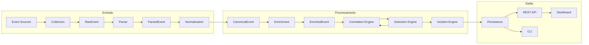
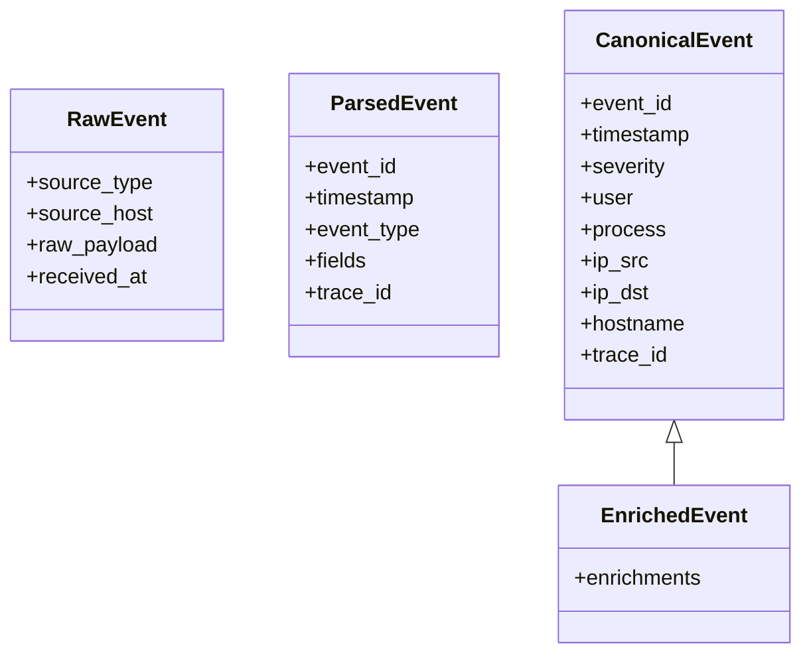

# EDY SIEM — Architecture

> Arquitetura de referência. Define camadas, fluxo de dados e regras de dependência.
> Todo código deve respeitar estas fronteiras. Nenhuma camada acessa outra fora do fluxo.

## 1. Fluxo do sistema

> **Pipeline oficial (ADR-008):** `Collector → RawEvent → Parser → ParsedEvent →
> Normalizer → CanonicalEvent → Enrichment → EnrichedEvent → Correlation →
> Detection → Alert → Incident → Case`. Cada modelo é imutável
> (`@dataclass(frozen=True)`) e cada estágio é uma função pura de transformação.

## 2. Camadas e responsabilidade única

| Camada | Responsabilidade | Proibido |
|---|---|---|
| `collectors` | Conectar a fontes (syslog, arquivos, API) e emitir eventos brutos | Normalizar, persistir |
| `parsers` | Extrair campos estruturados do payload bruto por source_type | Correlacionar |
| `ingestion` | Receber eventos, validar esquema bruto, aplicar backpressure | Correlacionar |
| `normalization` | Converter evento bruto para o **modelo de evento canônico** | Enriquecer |
| `enrichment` | Adicionar contexto (geo, WHOIS, asset, threat intel) | Persistir |
| `correlation` | Agregar eventos relacionados (janela, identidade) | Detectar sozinho |
| `detection` | Aplicar detection rules e gerar alertas (MITRE) | Resolver incidentes |
| `incident` | Agrupar alertas em incidentes e gerir ciclo de vida | Normalizar |
| `persistence` | Armazenar eventos, alertas, incidentes, regras | Aplicar regras |
| `api` | Expor contratos REST estáveis | Acessar UI |
| `ui` | Experiência do operador (consultas, triagem, investigação) | Acessar persistência direto |
| `cli` | Operações via terminal (ingestão manual, consultas, admin) | Acessar UI |

## 3. Regras de dependência (obrigatórias)

1. **Direção única:** Entrada → Processamento → Persistência → Saída.
2. **Nunca** uma camada de processamento acessa `persistence` fora do fluxo definido.
3. **Nunca** a UI acessa `persistence` diretamente — somente via API.
4. **Contratos entre camadas** (schemas) são definidos em `core` e compartilhados.
5. Cada camada é um módulo Python com API pública explícita (`__init__.py`).
6. Dependências entre camadas usam **interfaces** (Protocol) — nunca classes concretas de outra camada.

## 4. Modelos da pipeline (visão geral)

A pipeline oficial trafega quatro modelos imutáveis (definidos em
`src/edysiem/domain/pipeline.py`):

| Modelo | Estágio de origem | Campos principais |
|---|---|---|
| `RawEvent` | Collector | source_type, source_host, raw_payload, received_at |
| `ParsedEvent` | Parser | event_id, timestamp, event_type, fields, raw, trace_id |
| `CanonicalEvent` | Normalizer | event_id, severity, user, process, ip_src, ip_dst, hostname, trace_id |
| `EnrichedEvent` | Enrichment | CanonicalEvent + enrichments (tupla de `Enrichment`) |

Detalhes do schema: `docs/DATABASE.md` e `docs/API_GUIDE.md` (contrato).

## 5. Estilo de arquitetura

- **Clean Architecture** com dependências apontando para o centro (domínio).
- **Ports & Adapters** para coletores, storage e enrichments.
- **Eventos como dados imutáveis** — um evento nunca é alterado após a normalização;
  enriquecimento cria eventos derivados anexados (não muta o original).
- **Pipeline linear** processado de forma idempotente (replay seguro).

## 6. Decisões de arquitetura

Toda decisão técnica relevante é registrada em `docs/adr/` com formato:
`ADR-NNN-titulo.md` (status, contexto, decisão, consequências).

Índice de ADRs: `docs/DECISIONS.md`.

## 7. Dependency Injection e Plugin System

- **DI**: contêiner leve no bootstrap (`app/container.py`) monta o grafo; serviços recebem
  interfaces (Protocol) injetadas — nunca instanciam dependências. Testes usam fakes.
- **Plugins**: registries tipados para `collectors`, `parsers`, `enrichers`, `rules`.
  Descoberta declarativa (config/setup); falha de plugin degrada, não derruba pipeline.
- **Detalhes:** `docs/DATAFLOW.md` §5–6 e `ADR-007`.

## 8. Critério transversal

Toda decisão deve responder: **como afeta manutenção, escalabilidade e UX daqui a um ano?**
Registrado no manifesto (`PROJECT_MANIFESTO.md` §9).
