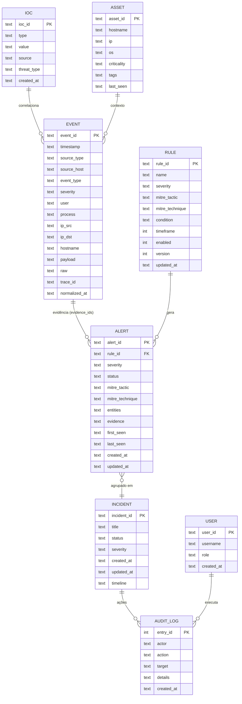

# EDY SIEM — Database Design

> Modelagem completa do banco (implementação na Sprint 1). Base: `DATABASE.md` + ADR-002.
> Acesso exclusivo via `app/persistence`. SQLite na fundação, motor trocável via Protocol.

## 1. ERD

## 2. Relacionamentos

| De | Para | Cardinalidade | Regra |
|---|---|---|---|
| Alert | Incident | N → 1 | alerta pertence a 0..1 incidente |
| Rule | Alert | 1 → N | regra gera vários alertas |
| Event | Alert | N → N | alerta referencia evidências (evidence_ids) |
| IOC | Event | N → N | IOC correlaciona eventos (match) |
| Asset | Event | 1 → N | asset é contexto de eventos |
| User | Audit | 1 → N | usuário executa ações |

## 3. Índices (consultas SOC)

| Tabela | Índice | Justificativa |
|---|---|---|
| events | `(timestamp)` | busca por janela |
| events | `(source_host, timestamp)` | contexto de host |
| events | `(ip_src)` | busca por IP |
| events | `(source_type, timestamp)` | filtro por fonte |
| alerts | `(severity, created_at)` | lista de prioridade |
| alerts | `(status)` | triagem |
| incidents | `(status)` | fila |
| iocs | `(type, value)` UNIQUE | dedupe |

## 4. Estratégias

- **Append-only** para events (nunca UPDATE/DELETE).
- **Soft-delete** para regras (enabled=0).
- **JSON** para payloads ricos (imutáveis); colunas para consulta frequente.
- **Migrações** versionadas em `scripts/migrations/` (apply na subida).
- **Retention/particionamento**: tema futuro (S3) via Protocol.
- **IDs**: prefixo por tipo (`evt_`, `alt_`, `inc_`, `rule_`, `ioc_`, `ast_`).
- **Timestamps**: ISO 8601 UTC (TEXT) — consistência e legibilidade.

## 5. Transações e concorrência

- Repositórios por agregado com transação atômica.
- Insert de evento não bloqueia leitura SOC (WAL mode).
- Regras/IOCs com UNIQUE + upsert.
- Idempotência: chave única permite re-insert seguro (replay).
