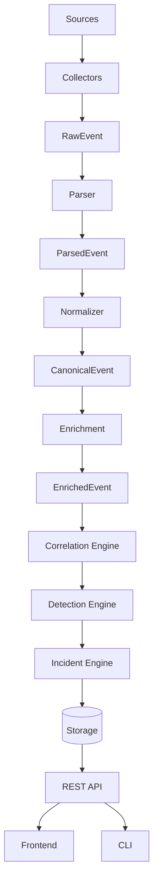
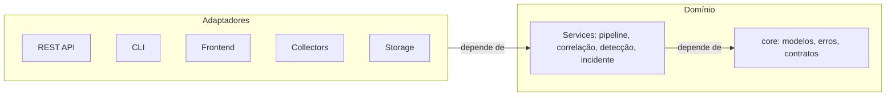

# EDY SIEM — Dataflow

> Fluxo de dados detalhado, etapa por etapa, com responsabilidades e contratos.
> Complementa `ARCHITECTURE.md`. Cada etapa é uma unidade com responsabilidade única.

## 1. Visão geral



> **Pipeline oficial (ADR-008):** `Collector → RawEvent → Parser → ParsedEvent →
> Normalizer → CanonicalEvent → Enrichment → EnrichedEvent → Correlation →
> Detection → Alert → Incident → Case`

## 2. Etapas e responsabilidades

### 2.1 Sources
Fontes externas: syslog (RFC 3164/5424), arquivos de log (Linux/Windows), API, ingestão manual.
**Entregam:** eventos brutos (linhas/payloads).

### 2.2 Collectors (`src/edysiem/collectors`)
**Responsabilidade:** conectar à fonte e emitir `RawEvent`.
**Contrato:**
```python
@dataclass(frozen=True)
class RawEvent:
    source_type: str
    source_host: str
    raw_payload: bytes | str  # conteúdo bruto
    event_id: str
    received_at: datetime
```
**Regras:** não normaliza; não persiste; tolerante a falha de conexão (reconexão).

### 2.3 Parser (`src/edysiem/parsers`)
**Responsabilidade:** extrair campos estruturados do `RawEvent` e produzir `ParsedEvent`.
**Contrato:**
```python
@dataclass(frozen=True)
class ParsedEvent:
    event_id: str
    timestamp: datetime
    source_type: str
    source_host: str
    event_type: str
    fields: dict[str, Any]   # campos estruturados extraídos
    raw: str | bytes
    trace_id: str
```
**Regras:** parser é função pura; novo formato = novo parser registrado no registry;
erro → `Result` (nunca `None`).

### 2.4 Normalizer (`src/edysiem/normalization`)
**Responsabilidade:** converter `ParsedEvent` em `CanonicalEvent` (modelo canônico).
**Contrato:**
```python
@dataclass(frozen=True)
class CanonicalEvent:
    event_id: str
    timestamp: datetime
    source_type: str
    source_host: str
    event_type: str
    severity: Severity
    user: str | None
    process: str | None
    ip_src: str | None
    ip_dst: str | None
    hostname: str | None
    payload: dict[str, Any]  # campos enriquecidos
    raw: str
    trace_id: str
    normalized_at: datetime
```
**Regras:** evento é **imutável**; validação de schema; falha → `Result` + drop controlado;
`trace_id` preenchido obrigatoriamente pela pipeline.

### 2.5 Enrichment (`src/edysiem/enrichment`)
**Responsabilidade:** anexar contexto (asset, geo, threat intel) e produzir `EnrichedEvent`.
**Contrato:**
```python
@dataclass(frozen=True)
class Enrichment:
    kind: str          # "asset" | "geo" | "intel" | ...
    provider: str
    data: dict[str, Any]
    created_at: datetime

@dataclass(frozen=True)
class EnrichedEvent(CanonicalEvent):
    enrichments: tuple[Enrichment, ...]
```
**Regras:** nunca muta o evento (cria derivado); timeout; falha degrada graciosamente
(dado opcional); enriquecimento produz `EnrichedEvent` — não altera o `CanonicalEvent`.

### 2.6 Correlation Engine (`app/correlation`)
**Responsabilidade:** agregar eventos relacionados em `CorrelatedEvent`.
**Critérios:** identidade (host/user/IP) + janela temporal + agregação (count/distinct/sum).
**Regras:** correlation rules declarativas (YAML); idempotente; janelas configuráveis.

### 2.7 Detection Engine (`app/detection`)
**Responsabilidade:** aplicar detection rules e gerar `Alert`.
**Contrato:**
```python
@dataclass(frozen=True)
class Alert:
    alert_id: str
    rule_id: str
    severity: Severity
    status: AlertStatus
    mitre: MitreRef | None
    entities: dict[str, str]
    evidence_ids: list[str]
    first_seen: datetime
    last_seen: datetime
```
**Regras:** regras declarativas com MITRE; sem execução arbitrária; deduplicação por fingerprint.

### 2.8 Incident Engine (`app/incident`)
**Responsabilidade:** agrupar alertas em incidentes e gerir ciclo de vida.
**Regras:** agrupamento por entidade/regra; status (open/investigating/resolved/false_positive);
timeline de ações; notas; auditoria.

### 2.9 Storage (`app/persistence`)
**Responsabilidade:** persistir eventos, alertas, incidentes, regras, IOCs, assets, audit.
**Regras:** repositórios por agregado via `Protocol`; eventos append-only; SQL parametrizado;
migrações versionadas.

### 2.10 REST API (`app/api`)
**Responsabilidade:** expor contratos estáveis (`/api/v1`).
**Regras:** orquestra serviços; nunca contém regra de negócio; erros estruturados com trace_id.

### 2.11 Frontend (`app/ui`)
**Responsabilidade:** experiência do operador.
**Regras:** consome API; nunca acessa storage diretamente.

## 3. Clean Architecture aplicada



- **Domínio** (`core`): modelos, erros, interfaces. Não importa nada externo.
- **Serviços**: orquestram etapas. Dependem do domínio.
- **Adaptadores**: HTTP, CLI, coletores, storage. Implementam contratos do domínio.

## 4. SOLID aplicado

- **S**: cada etapa/classe tem uma responsabilidade.
- **O**: novas fontes/regras/enrichers = extensão (registry), não modificação.
- **L**: implementações de Protocol são substituíveis.
- **I**: interfaces pequenas por papel (ex.: `EventRepository`, `AlertRepository`).
- **D**: dependências injetadas (ver §6), nunca instanciadas dentro do consumidor.

## 5. Dependency Injection

- Contêiner leve de DI no bootstrap (`app/container.py`) que monta o grafo de dependências.
- Interfaces do domínio são injetadas: `Pipeline(repo: EventRepository, rules: RuleProvider)`.
- Testes injetam fakes (storage em memória, fontes simuladas) sem tocar produção.

## 6. Plugin System

- **Registries**: parsers, enrichers, rules (detection/correlation), collectors.
- **Contratos:** classes abstratas/Protocol em `core/contracts/`.
- **Descoberta:** entrada declarada (setup) ou arquivo de config — sem import mágico.
- **Isolamento:** plugin falha não derruba pipeline (try/except + log + métrica).
- **Segurança:** regras são dados (YAML validado), não código executável.
