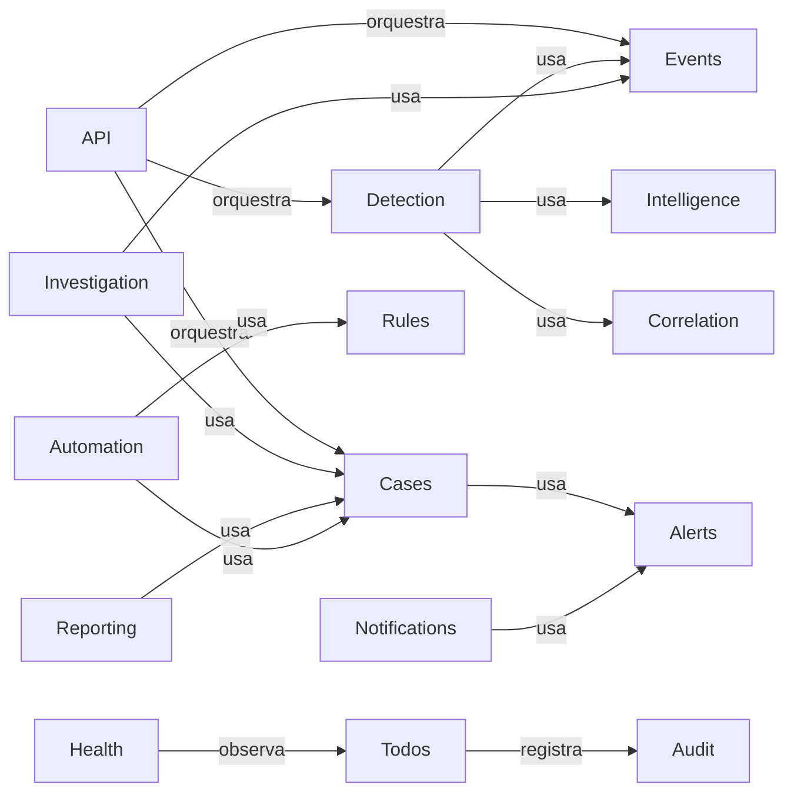
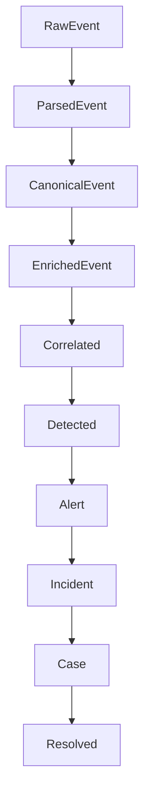
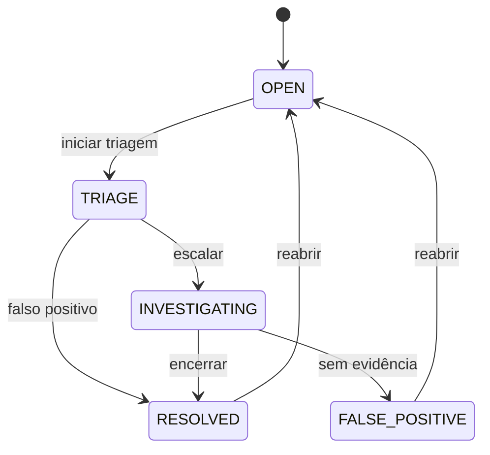
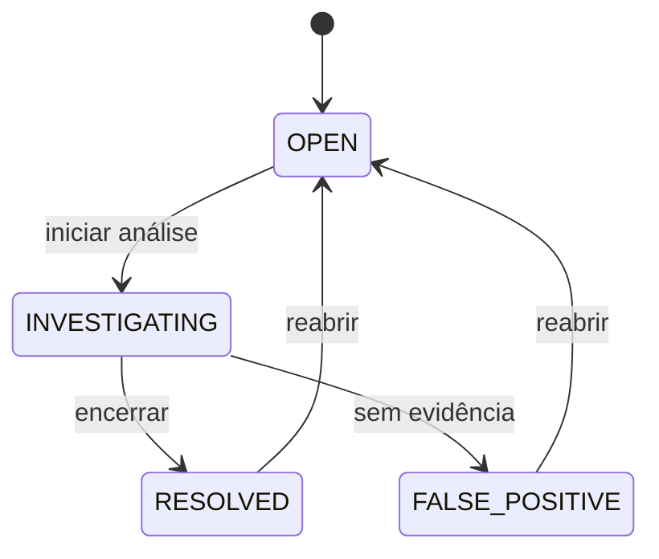
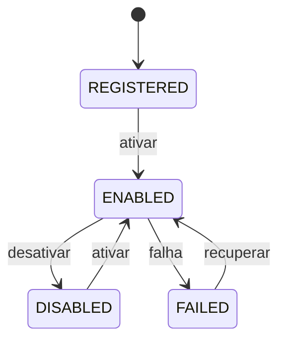
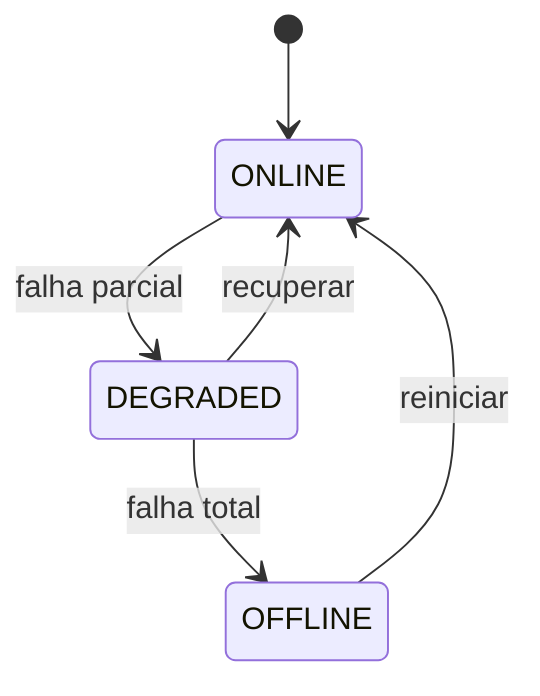
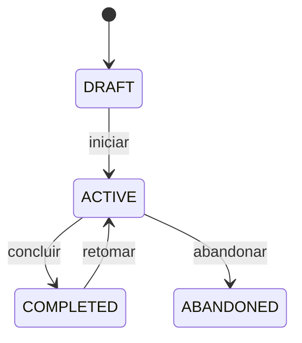

# EDY SIEM — Domain Model

> Modelagem completa do domínio (DDD). Bounded contexts, linguagem ubíqua, entidades,
> value objects, aggregates, lifecycle, state machines e domain events.
> Base para toda implementação.

---

## 1. Bounded Contexts

### 1.1 Mapa completo

| Contexto | Responsabilidade | Depende de |
|---|---|---|
| **Core** | Modelo canônico, trace_id, contratos | — |
| **Events** | Ingestão, normalização, enriquecimento | Core |
| **Assets** | Inventário e contexto de ativos | Core, Events (leitura) |
| **Users** | Identidade, papéis, credenciais | Core |
| **Alerts** | Ciclo de vida de alertas, triagem | Detection, Events |
| **Detection** | Regras de detecção, geração de alertas, MITRE | Core, Events, Intelligence |
| **Correlation** | Agregação de eventos correlacionados | Core, Events |
| **Threat Intelligence** | IOCs, feeds, reputação | Core, Events (match) |
| **Cases** | Agrupamento de alertas em casos/incidentes | Alerts, Detection |
| **Investigation** | Timeline, evidências, notas, entidades | Cases, Events |
| **Rules** | Catálogo de regras (detection/correlation) | Core |
| **Plugins** | Registries de coletores/parsers/enrichers | Core, Contracts |
| **Configuration** | Config tipada (env) e preferências | Core |
| **Reporting** | Relatórios, exportações | Cases, Events |
| **Audit** | Trilha de auditoria | Core, Users |
| **Automation** | Ações automáticas (responder) | Cases, Rules |
| **Health** | Estado de componentes, métricas | Todos (leitura) |
| **Notifications** | Notificações (email/webhook) | Alerts, Cases |
| **API** | Contratos REST | Todos (orquestração) |

### 1.2 Dependências permitidas

Regra: contexto filho depende apenas dos declarados; nunca acesso transversal não listado.

---

## 2. Entidades

### 2.1 Event
- **Responsabilidade:** representar uma ocorrência observável (canônico, imutável).
- **Modelos da pipeline (ADR-008):** `RawEvent` → `ParsedEvent` → `CanonicalEvent` →
  `EnrichedEvent` — cada um imutável e produzido por um estágio específico.
- **Relacionamentos:** → Alert (evidência); ← Source; ← Asset (contexto).
- **Lifecycle:** Raw → Parsed → Normalized → Enriched (derivados).
- **Estados:** recebido → normalizado → enriquecido → correlacionado (não-mutável: derivados).
- **Regras:** imutável; trace_id obrigatório em produção; append-only.

### 2.2 Alert
- **Responsabilidade:** resultado de detecção; o que aconteceu + impacto.
- **Relacionamentos:** → Rule; → Incident/Case; → Evidence (events).
- **Lifecycle:** OPEN → TRIAGE → INVESTIGATING → RESOLVED / FALSE_POSITIVE.
- **Estados:** ver state machine (§4).
- **Regras:** dedupe por fingerprint; MITRE obrigatório.

### 2.3 Case (Incident)
- **Responsabilidade:** agrupar alertas sob gestão/resposta.
- **Relacionamentos:** ← Alerts (1..N); → Investigation; → Report.
- **Lifecycle:** OPEN → INVESTIGATING → RESOLVED / FALSE_POSITIVE (reopen).
- **Regras:** timeline de ações; notas auditadas.

### 2.4 Asset
- **Responsabilidade:** inventário de ativos monitorados.
- **Relacionamentos:** → Events (contexto); → Alerts.
- **Estados:** ativo / inativo (soft).
- **Regras:** hostname/IP únicos; criticality; tags.

### 2.5 Rule (Detection/Correlation)
- **Responsabilidade:** condição declarativa que gera alerta/correlação.
- **Relacionamentos:** → Alert (gera); → MITRE.
- **Lifecycle:** draft → active → disabled (soft).
- **Regras:** schema validado; versão; teste obrigatório antes de ativar.

### 2.6 Correlation
- **Responsabilidade:** agrupar eventos por identidade + janela + agregação.
- **Relacionamentos:** ← Events; → Detection.
- **Regras:** idempotente; janelas configuráveis.

### 2.7 IOC
- **Responsabilidade:** indicador de comprometimento.
- **Relacionamentos:** → ThreatFeed; → Events (match).
- **Estados:** ativo / revogado.
- **Regras:** UNIQUE (type, value).

### 2.8 ThreatFeed
- **Responsabilidade:** fonte de intel (lista de IOCs/reputação).
- **Relacionamentos:** → IOC.
- **Regras:** fonte confiável; versionável.

### 2.9 User / Role
- **Responsabilidade:** identidade e papel (analyst/admin).
- **Relacionamentos:** → Audit; → Notifications.
- **Regras:** RBAC mínimo; ações auditadas.

### 2.10 Evidence
- **Responsabilidade:** conjunto de eventos que sustentam um alerta.
- **Relacionamentos:** → Alert; → Event.
- **Regras:** referências imutáveis.

### 2.11 Investigation / Timeline / Comment
- **Investigation:** contexto de análise de um case (entity-centric).
- **Timeline:** sequência cronológica de eventos/ações.
- **Comment:** nota com autor+hora.
- **Regras:** timeline append-only; comments auditados.

### 2.12 Notification / Plugin / HealthStatus / Report
- **Notification:** aviso (email/webhook) sobre alerta/case.
- **Plugin:** coletor/parser/enricher registrado.
- **HealthStatus:** estado de um componente (online/degraded/offline).
- **Report:** exportação (JSON/MD) de case/investigação.

---

## 3. Event Lifecycle

> Pipeline oficial (ADR-008): cada transformação produz um modelo imutável novo.

Etapa | Saída | Consumidor
|---|---|---|
| Raw | `RawEvent` | Parser |
| Parsed | `ParsedEvent` | Normalizer |
| Normalized | `CanonicalEvent` | Enrichment |
| Enriched | `EnrichedEvent` | Correlation |
| Correlated | `CorrelatedEvent` | Detection |
| Detected | `Alert` | Incident |
| Incident | agrupamento de alertas | Case |
| Case | workspace gerenciado | Resolved |

---

## 4. State Machines

### 4.1 Alert

### 4.2 Case/Incident

### 4.3 Plugin

### 4.4 Health

### 4.5 Investigation

---

## 5. Domain Events

| Evento | Publicado por | Consumidores |
|---|---|---|
| `event.normalized` | Normalizer | Enrichment, telemetria |
| `event.enriched` | Enrichment | Correlation |
| `correlated.created` | Correlation | Detection |
| `alert.created` | Detection | Cases, Audit, Notifications |
| `alert.updated` | Alerts/API | Audit |
| `case.created` | Cases | Investigation, Notifications |
| `case.updated` | Cases | Audit |
| `rule.changed` | Rules | Detection (recarga) |
| `ioc.changed` | Intelligence | Detection |
| `asset.changed` | Assets | Enrichment |

---

## 6. Value Objects principais

`Severity`, `MitreRef`, `Entities`, `Fingerprint`, `Enrichment`, `TimeRange`, `Filter`,
`Pagination`, `Note`, `TraceId`, `HealthStatus`, `PluginDescriptor`, `ReportFormat`.

---

## 7. Regras globais

1. Evento imutável após normalização; derivados nunca mutam o original.
2. Nenhum contexto cria entidade de outro contexto sem serviço dono.
3. Transições de status validadas e auditadas.
4. Fingerprint determinístico (dedupe).
5. MITRE e severidade obrigatórios em alertas.
6. Idempotência em inserts (chave/fingerprint).
7. Nenhuma regra de negócio fora do contexto dono.
8. Toda ação de usuário gera Audit.
