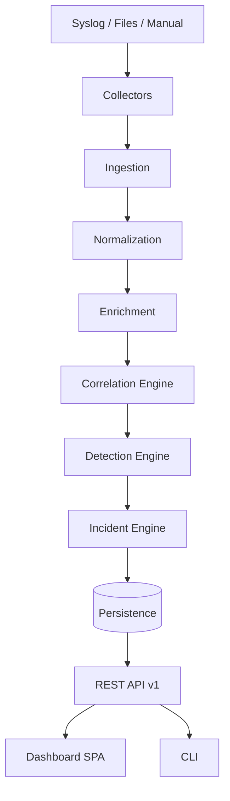

# EDY SIEM — System Design

> Projeto de sistema em nível de componentes. Descreve módulos, dados e integrações
> de forma que a Sprint 1 possa iniciar sem ambiguidade.

## 1. Componentes principais

### 1.1 Collectors
- `syslog_collector`: servidor UDP/TCP que recebe eventos syslog (RFC 3164/5424).
- `file_watcher`: monitora arquivos de log (Linux/Windows) com tail -f equivalente.
- `windows_event_collector` (futuro): consulta Windows Event Log (EVTX/Wevtutil).
- `manual_ingest`: CLI para importar arquivos de log existentes (estudo/offline).

Contrato: cada collector emite `RawEvent(source_type, source_host, received_at, raw_payload)`.

### 1.2 Ingestion
- `ingestor`: fila interna de entrada, validação básica e **backpressure**.
- Garante que o pipeline nunca receba mais do que `normalization` consegue processar.

### 1.3 Normalization
- `normalizer`: converte `ParsedEvent` → `CanonicalEvent` aplicando mapeamento por `source_type`.
- Extensível via `parser plugins` (syslog → campo comum; apache → campo comum; etc.).
- Saída: `CanonicalEvent` imutável (ADR-008).

### 1.4 Enrichment
- `geo_enricher`, `asset_enricher`, `threat_intel_enricher` (IOC lookup).
- Cada enricher recebe `CanonicalEvent` e produz `EnrichedEvent` (imutável) com
  contextos anexados (`Enrichment`).
- Falha de enricher NUNCA derruba o pipeline (graceful degradation).

### 1.5 Correlation Engine
- Consome eventos normalizados e aplica **correlation rules**.
- Conceitos: janela temporal, identidade (asset, user, IP), agregação (count, distinct).
- Saída: `CorrelatedEvent` (relaciona eventos por critério).

### 1.6 Detection Engine
- Consome `CorrelatedEvent` e `CanonicalEvent`.
- Aplica **detection rules** (YAML/JSON declarativo).
- Cada regra possui: id, nome, severidade, MITRE ATT&CK (tactic/technique), condição.
- Saída: `Alert(alert_id, rule_id, severity, entities, evidence, mitre)`.

### 1.7 Incident Engine
- Agrupa alertas relacionados em **incidentes**.
- Ciclo de vida: OPEN → TRIAGE → INVESTIGATING → RESOLVED / FALSE_POSITIVE.
- Permite notas, atribuição e timeline de ações.

### 1.8 Persistence
- Repositórios por agregado: eventos, alertas, incidentes, regras, assets, iocs, users.
- Transações atômicas por agregado. Índices para consulta SOC.

### 1.9 API
- Contratos REST versionados (`/api/v1/...`).
- Endpoints: eventos (search), alertas, incidentes, regras, iocs, assets, health.

### 1.10 UI
- SPA (frontend próprio, ver `docs/ux/style-guide.md`).
- Páginas: Overview, Events, Alerts, Incidents, Rules, Intelligence, Assets, Settings.

## 2. Diagrama de componentes

## 3. Fluxo de um evento (exemplo didático)

1. `syslog_collector` recebe linha do rsyslog → `RawEvent`.
2. `ingestor` valida e enfileira.
3. `parser` `syslog` converte para `ParsedEvent`.
4. `normalizer` converte para `CanonicalEvent`.
5. `enricher` anexa geo/asset/intel (se disponível) → `EnrichedEvent`.
6. `correlation` detecta 5 falhas de login no mesmo host em 60s → `CorrelatedEvent`.
7. `detection` regra "Múltiplas falhas de login" → `Alert` (severity high, MITRE T1110).
8. `incident` agrupa alerta com outros do mesmo host → `Incident OPEN`.
9. Persistido; visível na API e no Dashboard.

## 4. Tolerância a falhas

- Enricher com timeout e fallback (dados opcionais).
- Correlation/Detection idempotentes (replay não duplica).
- Persistence com retry e transações.
- API sempre responde JSON estruturado (erro com código e trace_id).
- Health endpoint expõe status de cada componente.

## 5. Modelagem de dados (resumo)

Ver `docs/architecture/database.md` para o modelo completo. Entidades raiz:
`Event`, `Alert`, `Incident`, `DetectionRule`, `CorrelationRule`, `IOC`, `Asset`, `User`, `AuditLog`.
