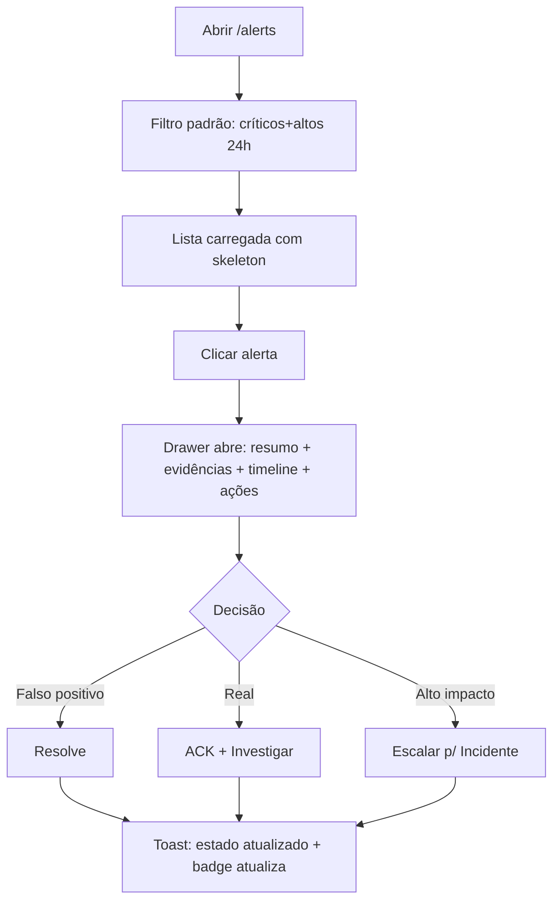
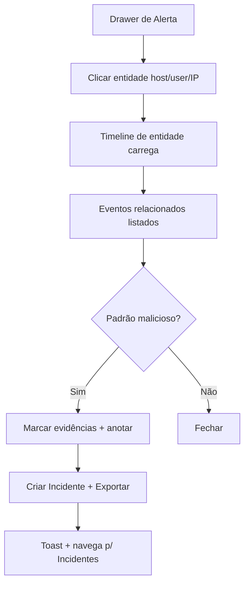
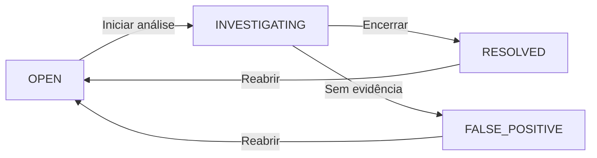
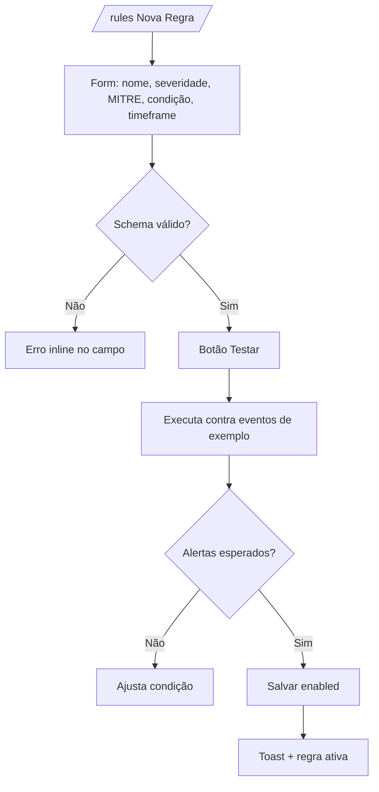
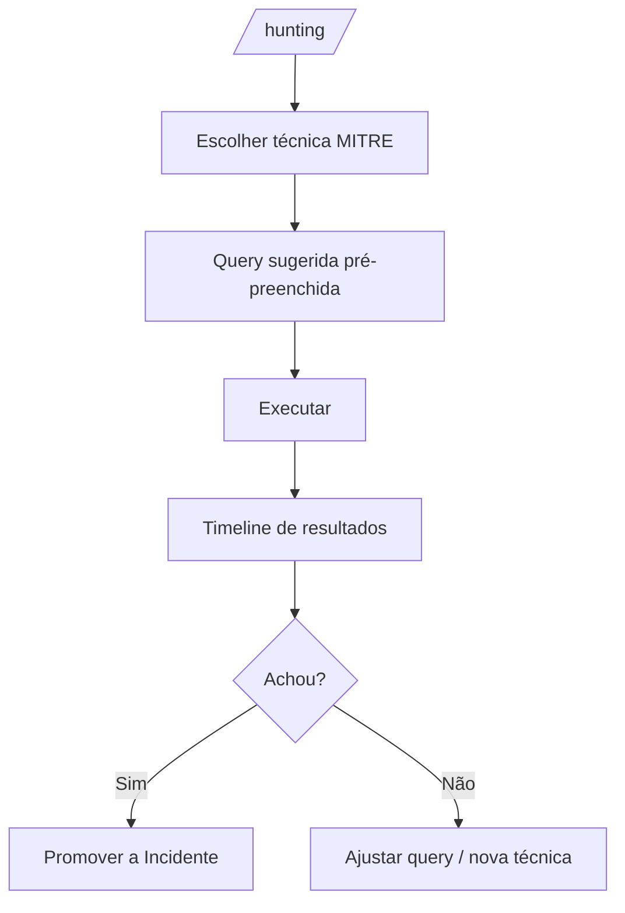

# EDY SIEM — UX Flow

> Fluxos de interação detalhados, tela por tela. Foco em **o que acontece em cada clique**
> e **estados possíveis**. Complementa `UX_ARCHITECTURE.md` e `WIREFRAMES.md`.

## Fluxo A — Triagem de Alerta

**Estados possíveis no Drawer:** carregando (skeleton) → carregado → erro (retry).
**Feedback:** toast em toda ação; lista re-renderiza; badge de status atualiza.

## Fluxo B — Investigação por Entidade

**Regra:** entidade clicável em qualquer drawer/tabela leva ao contexto da entidade.

## Fluxo C — Ciclo de Incidente

**Transições:** cada mudança registra auditoria (quem/quando/nota) e atualiza timeline.

## Fluxo D — Criação de Regra

**Regra:** "testar" é obrigatório antes de publicar regra nova.

## Fluxo E — Hunting

## Regras transversais de fluxo

1. **Carregamento:** sempre skeleton no primeiro render; refresh silencioso preserva dados.
2. **Erro:** mensagem clara + retry; nunca tela vazia sem explicação.
3. **Vazio:** orientação de próxima ação.
4. **Ação em lote:** confirmação quando > 5 itens ou destrutiva.
5. **Navegação interna:** filtros/estado preservados (nunca recarrega perde contexto).
6. **Acessibilidade:** ESC fecha sobreposições; teclado navega; foco retorna ao gatilho.
