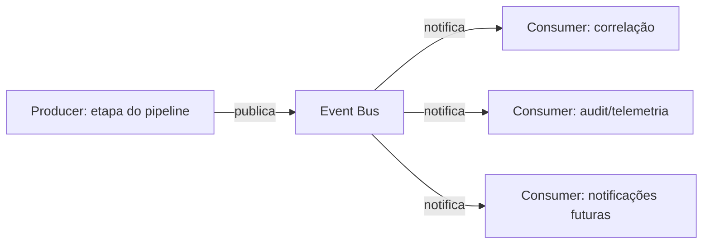

# EDY SIEM — Event Bus

> Projeto do Event Bus interno (implementação na Sprint 1). Desacopla etapas do pipeline
> e permite extensão por assinantes.

## 1. Conceito

Event Bus = canal onde produtores publicam eventos e consumidores assinam.
No EDY SIEM, usado para **eventos de domínio** (não confundir com eventos de log):

- `event.normalized`
- `event.enriched`
- `alert.created`
- `incident.updated`
- `rule.changed`

## 2. Fluxo



## 3. Contratos

```python
@dataclass(frozen=True)
class DomainEvent:
    event_type: str          # "event.normalized"
    occurred_at: datetime
    trace_id: str
    payload: dict[str, Any]  # dados do evento de domínio

class EventBus(Protocol):
    def publish(self, event: DomainEvent) -> None: ...
    def subscribe(self, event_type: str, handler) -> None: ...
```

## 4. Producer/Consumer

- **Producer**: etapa publica após sucesso (normalização publica `event.normalized`).
- **Consumer**: registrado por tipo; processa de forma isolada (falha não afeta outros).
- Ordem: consumidores síncronos para etapas críticas; assíncronos para efeitos laterais.

## 5. Schemas e versionamento

- Cada `event_type` tem schema de payload versionado (`event.normalized.v1`).
- Mudança quebradora → novo tipo `...v2` (consumidores antigos continuam).
- Schemas documentados em `app/core/events/schemas/` (dataclasses tipadas).

## 6. Implementação planejada

- Event Bus síncrono/em memória na v1 (padrão Observer com registry).
- Falha de consumer: log + métrica; não propaga para o producer (isolamento).
- Substituível por fila externa (Kafka) no futuro sem mudar contratos (ADR-003/007).
- Eventos de domínio ≠ eventos SIEM: nunca confundir (o SIEM usa pipeline linear).

## 7. Regras

- Produtor não conhece consumidores.
- Payloads imutáveis.
- Sem payloads sensíveis (audit de ação é registrado no Audit Log).
- Todo evento registra `trace_id` para rastreio ponta a ponta.
