# EDY Shield → EDY SIEM — Handoff de Arquitetura

**Status:** contrato/receptor, producer/outbox e primeiro E2E real concluídos.
**Data da análise:** 2026-08-11
**EDY SIEM analisado:** `master` em `e929982` (v0.2.0)
**EDY Shield analisado:** `main` em `5fd63bb` (v2.2.0)

## 1. Objetivo e restrições

Construir uma integração real na qual o EDY Shield permanece uma ferramenta local e
autônoma de defesa de endpoint, enquanto o EDY SIEM recebe sua telemetria, normaliza,
enriquece, correlaciona, detecta, gera alertas, agrupa incidentes e cria casos conforme
política.

Restrições obrigatórias:

- O Shield continua funcionando normalmente se o SIEM estiver offline.
- O caminho crítico de scan, FIM, baseline, análise e alerta local não depende da rede.
- Não existe acesso direto ao banco do outro produto.
- Cada produto é dono de seu próprio schema, migrações, retenção e credenciais.
- A entrega é pelo menos uma vez (*at-least-once*) e idempotente no SIEM.
- A API de integração é versionada e diferente das APIs internas das interfaces.
- Nenhum dado operacional é fabricado no frontend.

## 2. Estado atual encontrado

### 2.1 EDY Shield

#### Arquitetura backend

- Python 3.12, núcleo 100% stdlib.
- Organização em `app/core`, `app/plugins`, `app/services`, `app/cli` e `app/ui`.
- O FIM é um plugin (`file_integrity`) com ações `baseline`, `scan` e `compare`.
- O servidor HTTP usa `http.server`; não há framework HTTP nem camada formal de
  middleware.
- A composição ocorre em `app/ui/server.py`, que instancia `PluginManager`,
  `HistoryStore`, `AnalysisService` e `AlertService`.

#### Arquitetura frontend

- SPA em HTML/CSS/JavaScript vanilla, servida pelo mesmo processo HTTP.
- Router por hash com `onLoad`, `onUnload` e cancelamento de fetch.
- Páginas: Dashboard, Alert Center, Rules, Assets, Logs, IOC Manager, System Health e
  Settings.
- Cliente HTTP global `window.EDY` usa `fetch` same-origin.
- O overlay de autenticação é apenas um placeholder visual e fica oculto por padrão.

#### APIs existentes

Principais rotas atuais:

- `POST /api/scan`: executa qualquer plugin e persiste o `ScanResult` no histórico.
- `GET /api/history` e `GET /api/history/{id}`: histórico de scans.
- `GET /api/fim/baselines` e `GET /api/fim/baselines/{id}`: baselines FIM.
- `POST /api/analyze`, `/api/analyze/string`, `/api/analyze/entropy`.
- `GET /api/alerts`, `/api/alerts/stats`, `/api/alerts/rules`.
- `POST /api/alerts/{id}/{action}` e `POST /api/alerts/batch`.
- Comentários, relacionados e exportação de investigação de alertas.
- `GET /api/health` e `GET /api/plugins`.

Não existe endpoint ou cliente para envio de telemetria ao EDY SIEM.

#### Modelos de dados relevantes

- `BaselineEntry`: path relativo, hash, tamanho, mtime e permissões.
- `Baseline`: ID, algoritmo, versão, data, raiz e entradas.
- `Snapshot`: fotografia efêmera de uma varredura.
- `FimDiff`: adicionados, modificados, removidos, inalterados e ignorados.
- `AlertEvent`: source, event_type, severity, target, data e timestamp.
- `AlertRecord`: ID, fingerprint, regra, severidade, status, alvo, contador,
  timestamps, detalhes e campos de reconhecimento/resolução.

#### Alertas e eventos

- `AlertEngine` avalia `AlertEvent` contra `AlertRule`, deduplica por fingerprint e
  entrega por canais locais.
- `AlertService` persiste e administra o ciclo NEW → ACKNOWLEDGED → RESOLVED ou
  SUPPRESSED.
- O plugin FIM produz `ScanResult` e `Finding`, mas o caminho de `POST /api/scan`
  apenas salva o resultado em `HistoryStore`.
- Hoje não existe ligação automática entre um `FimDiff`/`ScanResult` e
  `AlertService.process_event`. Essa é a primeira lacuna a fechar antes do transporte.

#### Autenticação e segurança

- Não há autenticação real nem autorização nas APIs do Shield.
- O campo `author`/`by` das ações é informado pelo cliente e não representa identidade
  autenticada.
- Existem CSP, `X-Frame-Options`, `nosniff`, `Referrer-Policy`, `Permissions-Policy`,
  limite de corpo JSON e proteção de caminhos.
- O servidor é adequado hoje para uso local; não deve ser exposto diretamente à
  internet.

#### Banco e armazenamento

- SQLite próprio em `~/.edyshield/edy_shield.db`, configurável por
  `EDYSHIELD_DB_PATH`.
- WAL e foreign keys habilitados.
- Tabelas: `scans`, `baselines`, `baseline_entries`, `analyses`, `alerts` e
  `alert_comments`.
- O payload completo de scans/análises e detalhes de alertas é JSON em colunas TEXT.

#### Testes

- Baseline publicada: 635 testes, 91,92% de cobertura, mypy strict e Ruff limpos.
- Há testes unitários, integração HTTP e E2E de CLI.
- FIM possui testes de baseline, scan, compare, corrupção, persistência e paths.
- Alertas possuem testes de regras, deduplicação, ciclo de vida, batch e endpoints.
- Não há testes de outbox, transporte, retry, idempotência remota ou operação offline,
  porque esses componentes ainda não existem.

### 2.2 EDY SIEM

#### Arquitetura backend

- Python 3.12 com Clean Architecture e core stdlib.
- FastAPI v1 na borda HTTP; composição manual em `ApplicationContainer`.
- Pipeline declarado: RawEvent → ParsedEvent → CanonicalEvent → EnrichedEvent →
  Correlation → Detection → Alert → Incident → Case.
- Engines separados para normalização, enrichment, correlação, detecção, alertas,
  incidentes e casos.
- Event Store e repositórios SQLite próprios.

#### Arquitetura frontend

- React 18 + TypeScript + Vite + React Router + Recharts.
- Design system Echelon próprio.
- API client central com timeout, retry de rede e tipos TypeScript.
- Hooks para métricas, alertas, incidentes, casos e saúde.
- Páginas operacionais: Dashboard, War Room, Triage, Alerts, Incidents,
  Investigation, Cases, Playbooks, Rules, Intelligence, Detection e Settings.

#### APIs existentes

Todas sob `/api/v1`:

- `POST /pipeline/run`: parse, normalize, enrich, correlate e detecta; não persiste o
  fluxo SOC completo.
- `POST /soc/pipeline/run`: usa `SocPipeline.run_event`, persiste alertas gerados e um
  registro canônico mínimo.
- `POST /soc/pipeline/demo`: único fluxo que hoje cria alertas, incidente e caso de
  ponta a ponta.
- CRUD/ações de alertas, incidentes e casos.
- Rotas SOC para rules, IOC, assets, investigation, detection e métricas.
- Health, version e metrics.

Lacunas confirmadas para a integração:

- O parser do `SocPipeline` tenta apenas RFC5424/RFC3164.
- Os normalizadores registrados são `syslog` e `windows`; não existe
  `source_type=edy_shield`.
- A rota SOC recebe `dict[str, Any]`, sem schema estrito para telemetria externa.
- O fluxo real de `run_event` para após criar alertas; não agrupa automaticamente
  incidentes nem cria casos.
- O Event Store registra apenas um payload canônico mínimo nesse caminho; não existe
  recibo idempotente nem inbox durável para produtores.

#### Modelos de dados relevantes

- `RawEvent`: source_type, source_host, raw_payload, event_id, received_at, tags e
  risk_score.
- `ParsedEvent`: categoria, ação, campos, raw, trace_id, vendor, product e confidence.
- `CanonicalEvent` v1.0.0: identidade, timestamps, host, categoria, ação, severidade,
  usuário/processo/rede, raw original, tags, confidence e metadata.
- `EnrichedEvent`: CanonicalEvent mais enrichments.
- Modelos ricos e persistidos para `Alert`, `Incident` e `Case`, incluindo MITRE,
  evidências, timeline, comentários, owner e playbook.

#### Alertas, incidentes e casos

- `AlertEngine` já fornece fingerprint, risco, deduplicação e lifecycle.
- `IncidentEngine` e `IncidentCorrelator` já agrupam alertas.
- `CaseEngine` já cria casos, evidências, comentários, tarefas, responsáveis e timeline.
- `SocService.create_incident_from_alerts` e `create_case_from_incident` são os pontos
  reutilizáveis corretos.
- `SocPipeline.run_demo` prova esse encadeamento, mas está acoplado a dados de demo.

#### Autenticação e segurança

- API key global opt-in por `EDYSIEM_API_KEY` e header `X-API-Key`.
- Se a variável não existir, a API fica aberta em modo de desenvolvimento.
- RBAC atual depende de `X-EDY-Role`; o default é `admin`, portanto não representa uma
  identidade confiável de produtor.
- Rate limit HTTP é em memória e por IP.
- A arquitetura documenta JWT/SSO futuro, mas isso ainda não é implementação atual.

#### Banco e armazenamento

- SQLite próprio via `ConnectionManager` e migrações.
- Tabelas: `alerts`, `incidents`, `cases`, `events`, `audit_entries`, `det_rules`,
  `iocs` e `assets`.
- Event Store possui estágios RAW, CANONICAL, ENRICHED, CORRELATED,
  DETECTION_FINDING, ALERT, INCIDENT e CASE.
- Não existe inbox de ingestão, recibo idempotente ou DLQ persistente.
- O arquivo `persistence/schema.py` termina com um `__all__` antigo que omite
  `SchemaV4`; `ALL_MIGRATIONS` ainda contém V4, portanto é dívida técnica não
  bloqueante a confirmar em implementação.

#### Testes

- Baseline publicada: 801 testes, 95,10% de cobertura, mypy strict e Ruff limpos.
- CI executa pytest, mypy, Ruff e build do frontend.
- Há cobertura específica para API, pipeline, normalização, ingestão, retry,
  backpressure, dead letter, correlação, detecção, persistência e fluxo SOC.
- Não existem testes de contrato `edy_shield`, batch idempotente, inbox durável ou
  reconciliação de outbox.

## 3. Arquitetura proposta

```mermaid
flowchart LR
    subgraph SHIELD[EDY Shield — dono do endpoint]
        FIM[FIM / Hash / Baseline / Scan]
        LOCAL[Persistência e alertas locais]
        MAP[Telemetry Mapper]
        OUT[(SQLite telemetry_outbox)]
        SEND[Delivery Worker]
        FIM --> LOCAL
        LOCAL --> MAP
        MAP --> OUT
        OUT --> SEND
    end

    subgraph SIEM[EDY SIEM — dono da operação SOC]
        API[Shield Ingestion API v1]
        INBOX[(SQLite ingestion_inbox)]
        WORKER[Ingestion Worker]
        PARSER[EdyShield Parser]
        NORM[Canonical Normalizer]
        ENRICH[Asset + Threat Intel Enrichment]
        CORR[Correlation + Detection]
        ALERT[Alert Engine]
        INCIDENT[Incident Engine]
        CASE[Case Policy + Case Engine]
        API --> INBOX
        INBOX --> WORKER
        WORKER --> PARSER
        PARSER --> NORM
        NORM --> ENRICH
        ENRICH --> CORR
        CORR --> ALERT
        ALERT --> INCIDENT
        INCIDENT --> CASE
    end

    SEND -- HTTPS + scoped token + batch --> API

    subgraph WAR[WAR_ROOM — futuro]
        FEED[Versioned Threat Intel Feed]
    end
    FEED --> ENRICH
```



### 3.1 Padrão de confiabilidade

O padrão aprovado/proposto é **local-first + transactional outbox no Shield + durable
inbox no SIEM**.

1. O Shield conclui e persiste sua operação local.
2. Na mesma unidade de trabalho local, grava um evento na `telemetry_outbox`.
3. Um worker independente tenta enviar lotes ao SIEM.
4. Falha de DNS, timeout, conexão, 408, 429 ou 5xx nunca falha o scan local.
5. Eventos permanecem pendentes e usam backoff exponencial com jitter.
6. O SIEM valida e grava primeiro em sua `ingestion_inbox`, depois responde `202`.
7. O worker do SIEM processa a inbox e registra o trail da pipeline.
8. A combinação `(source.instance_id, event_id)` é única no SIEM.
9. Reenvio do mesmo conteúdo é resposta idempotente; mesmo ID com conteúdo diferente
   retorna conflito e vai para auditoria.

Semântica: **at-least-once no transporte, exactly-once lógico por idempotência**.

### 3.2 Contrato HTTP v1 aprovado

O contrato normativo completo, incluindo validação e sete exemplos, está em
[`EVENT_CONTRACT_V1.md`](EVENT_CONTRACT_V1.md). Em caso de divergência com o desenho
preliminar deste handoff, o contrato oficial prevalece.

Endpoint:

`POST /api/v1/ingestion/sources/edy-shield/events`

Headers:

- `Authorization: Bearer <token exclusivo do Shield>`
- `Content-Type: application/json`
- `Idempotency-Key: <batch_id UUID>`

O token deve conceder somente `ingestion:shield:write`. O endpoint não deve aceitar o
papel informado pelo cliente. TLS é obrigatório fora de loopback/laboratório.

Envelope resumido:

```json
{
  "batch_id": "a65c942d-6aa7-4b1a-9bb2-f04546bcb540",
  "sent_at": "2026-08-11T18:42:15.120Z",
  "events": [
    {
      "event_id": "7a4ec1d2-3b61-4e9c-8f12-2b9a6e1d4501",
      "schema_version": "1.0",
      "timestamp": "2026-08-11T18:42:10.123Z",
      "sequence": 184,
      "source": {
        "product": "edy-shield",
        "product_version": "2.2.0",
        "instance_id": "9df3e3b7-f905-49f8-b6a7-3da64227e3d1",
        "component": "fim"
      },
      "event_type": "shield.fim.file.modified",
      "severity": "high",
      "asset": {
        "asset_id": "shield:9df3e3b7-f905-49f8-b6a7-3da64227e3d1:ws-01",
        "hostname": "ws-01"
      },
      "evidence": {
        "file_path": "Windows/System32/drivers/etc/hosts",
        "hash_algorithm": "sha256",
        "previous_hash": "aaaaaaaaaaaaaaaaaaaaaaaaaaaaaaaaaaaaaaaaaaaaaaaaaaaaaaaaaaaaaaaa",
        "current_hash": "bbbbbbbbbbbbbbbbbbbbbbbbbbbbbbbbbbbbbbbbbbbbbbbbbbbbbbbbbbbbbbbb",
        "baseline_id": "fim-sha256-20260811-001",
        "baseline_status": "modified",
        "scan_id": "scan-20260811-1842",
        "details": {}
      },
      "metadata": {"correlation_id": "scan-20260811-1842", "tags": ["fim"]}
    }
  ]
}
```

Resposta por item:

- `accepted`: persistido para processamento.
- `duplicate`: já recebido com o mesmo hash de conteúdo.
- `rejected`: inválido e não será repetido sem correção.

O Shield remove/arquiva da outbox apenas itens `accepted` ou `duplicate`. Rejeições
permanentes vão para `dead_letter`; falhas transitórias permanecem pendentes. `401` e
`403` pausam o conector e preservam a fila para correção da credencial.

### 3.3 Tipos de evento v1

| Tipo | Quando emitir | Campos principais |
|---|---|---|
| `shield.fim.baseline.created` | baseline persistida | baseline_id, algoritmo, raiz lógica, quantidade |
| `shield.fim.scan.completed` | scan comparado | scan_id, baseline_id, totais added/modified/removed/ignored |
| `shield.fim.file.added` | arquivo novo | path, hash atual, tamanho, mtime |
| `shield.fim.file.modified` | conteúdo alterado | path, hash anterior/atual, metadados antes/depois |
| `shield.fim.file.removed` | arquivo removido | path, hash anterior, baseline_id |
| `shield.hash.verified` | verificação concluída | algoritmo, digest, matched |
| `shield.hash.mismatch` | hash diferente do esperado | esperado, calculado, algoritmo, alvo |
| `shield.alert.created` | alerta local criado | alert_id, rule_id, severity, target, fingerprint |
| `shield.alert.updated` | lifecycle local alterado | alert_id, status, actor local, note resumida |

Decisão: eventos FIM continuam sendo a fonte primária. `shield.alert.created` é contexto
adicional; o SIEM não deve importar cegamente o alerta local como alerta final. Ele o
normaliza e aplica suas próprias regras para evitar dupla contagem.

### 3.4 Mapeamento para CanonicalEvent

| Shield | CanonicalEvent do SIEM |
|---|---|
| `event_id` | `CanonicalEvent.event_id`, `metadata.origin_event_id` e chave de recibo |
| `source.instance_id` | `metadata.source_instance_id` |
| `asset.hostname` | `source_host` e `hostname` |
| `event_type` FIM | `event_category=file`; ação added/modified/deleted/baseline/scan |
| `severity` | severidade inicial, recalculável por regra SIEM |
| `evidence.file_path` | `metadata.evidence.file_path` e contexto de asset |
| `evidence.previous_hash/current_hash/hash_algorithm` | `metadata.evidence.*` |
| `evidence.baseline_id` / `scan_id` | `metadata.evidence.*` e correlation keys futuras |
| `timestamp` | `timestamp` |
| recebimento | `received_at` gerado pelo SIEM |
| tags | tags de origem preservadas no conjunto canônico |

O payload original validado é preservado no Event Store para investigação e reprocessamento,
com limites de tamanho e sanitização de secrets.

### 3.5 Política de incidente e caso

- Um evento aceito não cria caso automaticamente.
- Regras de detecção geram alertas.
- Alertas são agrupados pelo `IncidentCorrelator` por host, scan/baseline, janela e
  fingerprint.
- Política inicial de caso:
  - caso automático para incidentes `critical`;
  - caso automático para `high` quando houver múltiplos arquivos/alertas na janela;
  - incidentes médios/baixos ficam disponíveis para promoção manual.
- O caso deve receber timeline da pipeline, evidências de hash/FIM, asset, MITRE,
  origem Shield e links de correlação.

### 3.6 Futura integração com WAR_ROOM

WAR_ROOM não entra no caminho de transporte Shield → SIEM. Ele será um provedor
independente de threat intelligence:

1. Feed versionado e assinado do WAR_ROOM entra por API/importer próprio.
2. O SIEM valida fonte, confiança, validade/TTL e persiste IOCs em seu próprio banco.
3. Um enrichment plugin consulta esse catálogo durante o processamento de eventos Shield.
4. Hash conhecido, caminho/artefato ou outro IOC adiciona enrichment
   `provider=war_room`, eleva risco e pode disparar regra de detecção.

Isso evita acoplar o Shield ao WAR_ROOM e mantém o SIEM como ponto de correlação.

## 4. Componentes existentes reutilizáveis

### Shield

- `FileIntegrityPlugin`, `Baseline`, `BaselineEntry`, `Snapshot` e `FimDiff`.
- `HistoryStore`, `FimStore`, `SQLiteDb` e serialização `ScanResult.as_dict()`.
- `AlertEvent`, `AlertEngine`, `AlertService`, fingerprints e lifecycle.
- Configuração env-driven e logging stdlib.
- Dashboard Settings/System Health para mostrar estado da integração.

### SIEM

- `RawEvent`, `ParsedEvent`, `CanonicalEvent` e `EnrichedEvent`.
- Registry/Strategy de normalização por `source_type`.
- Engines de enrichment, correlação, detecção e alertas.
- `SocService`, `IncidentEngine`, `IncidentCorrelator` e `CaseEngine`.
- Event Store com stages e audit trail.
- Infraestruturas existentes de retry, rate limit, backpressure e dead letter como
  políticas reutilizáveis; precisam de adapters persistentes para esta integração.
- React API client, hooks e páginas de Alert/Incident/Case/Investigation.

## 5. Componentes que precisam ser criados

### No EDY Shield

1. Modelos `TelemetryEventV1`, `TelemetryBatchV1` e enums de estado.
2. `TelemetryMapper` para ScanResult/FimDiff/AlertRecord.
3. Migração e `TelemetryOutboxRepository` no SQLite local.
4. Unit of Work que persista operação local + outbox de forma atômica.
5. `SiemTransport` (Protocol) e `HttpSiemTransport` com timeout curto.
6. `TelemetryDeliveryWorker` com batch, retry, jitter e retenção.
7. Configurações: enabled, URL, instance ID, token, timeout, batch size e retry.
8. Estado/health da integração e controles de retry na UI.

### No EDY SIEM

1. ADR formal da integração e contrato JSON/Pydantic v1.
2. Endpoint exclusivo e autenticação scoped de produtor.
3. Migrações `ingestion_batches`/`ingestion_inbox` com chave idempotente.
4. `EdyShieldParser` e normalizer registrado para `source_type=edy_shield`.
5. Worker durável de inbox e DLQ persistente.
6. Orquestrador de ingestão que registra todos os stages e usa os engines existentes.
7. Política de incidente/caso fora do fluxo de demo.
8. Regras iniciais FIM e mapeamentos MITRE.
9. API de status da fonte e UI de Source/Connector Health.
10. Exibição de origem, baseline, scan, hashes e arquivo na investigação.

## 6. Riscos e mitigação

| Risco | Impacto | Mitigação |
|---|---|---|
| SIEM offline ou lento | Bloquear Shield/perder evento | outbox local; timeout curto; envio assíncrono |
| Entrega duplicada | alertas/casos duplicados | chave idempotente + content hash + fingerprints |
| Queda após salvar local e antes da outbox | lacuna de telemetria | Unit of Work no mesmo SQLite + job de reconciliação |
| Queda do SIEM após aceitar lote | perda silenciosa | durable inbox antes de responder 202 |
| Ordem diferente | correlação incorreta | `sequence` por instância + `timestamp`; pipeline tolerante a atraso |
| Crescimento ilimitado da outbox | disco cheio no endpoint | limites, retenção, métricas e prioridade; nunca apagar silenciosamente |
| Caminhos/hashes sensíveis | exposição de dados | minimização, allow/deny patterns, TLS e redaction |
| Token global ou papel forjável | ingestão não autorizada | credencial scoped por fonte; não confiar em `X-EDY-Role` |
| Evento malformado/DoS | sobrecarga do SIEM | Pydantic strict, limite de batch/body, rate limit por fonte |
| Dupla detecção local/remota | métricas infladas | evento local é telemetria; SIEM decide alerta final |
| Schema evoluir sem compatibilidade | quebra de produtores | versão explícita, compatibilidade N/N-1 e contract tests |
| SQLite concorrente | lock/latência | batches curtos, WAL, índices e worker com backpressure |
| Caminho de demo divergir do real | falso senso de completude | E2E real Shield → API → inbox → case; demo usa o mesmo caminho |

## 7. Plano em pequenas etapas

### Etapa 0 — Decisão e contrato

- [x] Fechar o contrato v1, tabela de mapeamento, dados sensíveis, limites e autenticação.
- [x] Criar o ADR-010 no SIEM.
- [x] Criar schema Pydantic executável e fixtures de contrato compartilháveis, sem pacote de
  runtime compartilhado.

**Saída:** golden contract versionado e validado por 85 testes automatizados.

### Etapa 1 — Conectar FIM ao domínio local do Shield

- Mapear `ScanResult`/`FimDiff` para `AlertEvent` local.
- Garantir que scan persiste resultado, emite eventos locais e mantém comportamento atual.
- Adicionar testes para added/modified/removed e dedup.

**Saída:** Shield gera telemetria estruturada localmente, ainda sem rede.

### Etapa 2 — Outbox resiliente no Shield

- Criar tabela, repository, Unit of Work e estados pending/sent/dead_letter.
- Implementar transport Protocol com fake em testes.
- Testar SIEM offline, restart, retry e limite de fila.

**Saída:** eventos nunca bloqueiam o Shield e sobrevivem a restart.

### Etapa 3 — Inbox e contrato de ingestão no SIEM

- [x] Criar endpoint scoped, schemas strict, autenticação e idempotência.
- [x] Persistir inbox antes do 202.
- [x] Testar batch misto accepted/duplicate/rejected e conflitos.

**Saída:** SIEM aceita eventos com durabilidade, sem ainda detectar.

### Etapa 4 — Parser e normalização EDY Shield

- Implementar parser/normalizer e registrar no container.
- Preservar payload original e registrar RAW/CANONICAL/ENRICHED.
- Testar todos os tipos v1 e edge cases de timestamp/hash/path.

**Saída:** telemetria Shield vira CanonicalEvent pesquisável.

### Etapa 5 — Detecção, incidente e caso reais

- Adicionar regras FIM iniciais e correlação por host/scan/janela.
- Reutilizar engines para alerta → incidente → política de caso.
- Remover a dependência conceitual do `run_demo` para o E2E.

**Saída:** um arquivo crítico modificado percorre o fluxo até o caso.

### Etapa 6 — UX operacional

- Shield: estado de conexão, fila pendente, último envio e retry manual.
- SIEM: connector health, badge `EDY Shield`, detalhes de FIM/hash/baseline e trail.
- Estados offline/degradado/rejeitado claros e acessíveis.

**Saída:** o analista entende origem, falha e próximo passo sem ler logs.

### Etapa 7 — Hardening e E2E

- TLS/config de produção, rotação de token, redaction e limites.
- Testes de queda, reenvio, duplicação, restart, carga e schema incompatível.
- Métricas: outbox depth, oldest pending age, ingest lag, accepted/rejected/dead letter.

**Saída:** integração pronta para release e demonstração de portfólio.

### Etapa 8 — WAR_ROOM threat intelligence

- Definir contrato de feed separado.
- Criar importer + enrichment provider.
- Correlacionar hashes/IOCs Shield com inteligência e confiança do WAR_ROOM.

## 8. Arquivos importantes encontrados

### EDY Shield

- `app/core/fim/models.py`
- `app/core/fim/scanner.py`
- `app/core/fim/store.py`
- `app/plugins/builtin/file_integrity_plugin.py`
- `app/core/alerts/models.py`
- `app/core/alerts/engine.py`
- `app/services/alert_service.py`
- `app/services/alert_store.py`
- `app/services/history.py`
- `app/core/storage/sqlite_db.py`
- `app/ui/server.py`
- `app/ui/static/dashboard/js/app.js`
- `tests/unit/test_fim_core.py`
- `tests/unit/test_fim_plugin.py`
- `tests/unit/test_alert_service.py`
- `tests/integration/test_ui_api.py`
- `tests/integration/test_m42_endpoints.py`

### EDY SIEM

- `src/edysiem/domain/pipeline.py`
- `src/edysiem/api/schemas.py`
- `src/edysiem/api/ingestion_schemas.py`
- `src/edysiem/api/routes/pipeline.py`
- `src/edysiem/api/routes/soc.py`
- `src/edysiem/api/security.py`
- `src/edysiem/normalization/registry.py`
- `src/edysiem/soc/pipeline.py`
- `src/edysiem/soc/service.py`
- `src/edysiem/persistence/event_store.py`
- `src/edysiem/persistence/schema.py`
- `src/edysiem/container.py`
- `frontend/src/api/client.ts`
- `frontend/src/pages/InvestigationPage.tsx`
- `tests/test_api.py`
- `tests/test_soc_api.py`
- `tests/test_soc_pipeline.py`
- `tests/test_persistence_engine.py`
- `tests/test_shield_event_contract_v1.py`
- `tests/fixtures/shield_events/v1/valid/`
- `tests/fixtures/shield_events/v1/invalid/`
- `docs/architecture/adr/ADR-010-shield-siem-event-integration.md`

## 9. Decisões tomadas nesta etapa

1. O contrato vive no SIEM; o Shield apenas implementa um adapter produtor.
2. Nenhum projeto importa módulos do outro e nenhum banco é compartilhado.
3. Transporte v1 é HTTP(S) em batch, com credencial scoped.
4. Shield usa outbox local; SIEM usa inbox durável.
5. Entrega é at-least-once com idempotência por produtor/evento.
6. FIM produz eventos por arquivo e um resumo por scan.
7. SIEM decide severidade final, alertas, incidentes e casos.
8. Casos não são criados para todo evento; seguem política de risco/correlação.
9. WAR_ROOM será um provider de enrichment independente, não dependência do Shield.
10. A UI é observabilidade e operação da integração, nunca o mecanismo de entrega.
11. O contrato oficial é `EVENT_CONTRACT_V1.md`; a versão inicial aceita é `1.0`.
12. O identificador idempotente é `(source.instance_id, event_id)` e o lote usa
    `Idempotency-Key = batch_id`.
13. A borda é strict: extensões somente em `evidence.details` e `metadata`; opcionais
    ausentes são omitidos e `null` é inválido.
14. O endpoint aceita até 100 eventos, 1 MiB por lote e 64 KiB por evento.
15. A autenticação v1 usa token scoped em variáveis de ambiente; a rota não confia em
    `X-EDY-Role` e HTTP é permitido somente em loopback/laboratório explícito.
16. Timeout é 2 s para conexão e 5 s total; retry usa full jitter com teto de 5 minutos.
17. A Etapa 0 usa golden contract: documentação, modelo Pydantic, sete fixtures válidas,
    oito inválidas e testes precisam permanecer equivalentes.
18. O cenário de baseline v1 é `shield.fim.baseline.created`; não existe
    `baseline_changed` no enum aprovado.

## 10. Pendências

- Implementar producer/outbox v1 no EDY Shield, sem bloquear scans quando o SIEM estiver offline.
- Conectar `FimDiff`, baseline, scan, hash e alertas locais ao mapper do contrato congelado.
- Escolher política inicial de auto-case e regras MITRE para FIM.
- Definir o mecanismo de cadastro/rotação de tokens por instalação além do laboratório.
- Confirmar a URL de implantação; fora de loopback, TLS é obrigatório.
- Definir telemetria/UI para overflow e saúde da fila antes da etapa de UX.
- Criar o worker posterior da inbox para enrichment, detecção, incidentes e casos; os
  registros aceitos permanecem em `processing_status=pending` nesta etapa.

## 11. Próximo passo exato

Implementar o **producer/outbox no EDY Shield**: criar o mapper para o Event Contract v1,
a `telemetry_outbox` transacional e o worker de entrega independente com timeout, retry,
backoff e recuperação após restart. O caminho de scan/FIM deve continuar local-first e
nunca aguardar a rede. Não implementar frontend nem processamento downstream da inbox
do SIEM nessa próxima etapa.

## 12. Estado do contrato v1

- Schema, enums, validação condicional, timestamps e limites: definidos.
- Endpoint, resposta parcial por item e códigos HTTP: definidos.
- Autenticação M2M sem secrets no código: definida.
- Idempotência, timeout, retry, backoff e outbox offline: definidos.
- Sete exemplos reais para inclusão, modificação, remoção, hash divergente, baseline,
  scan e alerta crítico: documentados e congelados como fixtures.
- ADR-010, modelo Pydantic e testes de contrato: concluídos.
- Validação: 85 testes focados (97,00% do modelo); suíte completa 886 testes, 95,17%;
  MyPy e Ruff aprovados.
- Receptor/inbox SIEM implementado; transporte/outbox/worker do Shield e frontend não
  foram implementados.

## 13. Implementação do receptor SIEM concluída

### Endpoint e autenticação

- Rota única: `POST /api/v1/ingestion/sources/edy-shield/events`.
- Bearer token M2M obrigatório em `EDYSIEM_SHIELD_INGEST_TOKEN`, com mínimo de 32 bytes
  e comparação em tempo constante.
- Rotação sem redesign por `EDYSIEM_SHIELD_INGEST_PREVIOUS_TOKEN` durante janela curta.
- A rota Shield não usa `X-EDY-Role` nem a API key global de operador.
- HTTPS é exigido fora de `localhost`, `127.0.0.1` e `::1`.
- Configuração de exemplo sem segredo real em `.env.example`.

### Durabilidade, batch e idempotência

- Migração v5 cria `ingestion_batches` e `ingestion_inbox` com índices operacionais.
- O recibo do lote e todos os eventos aceitos são persistidos na mesma transação
  `BEGIN IMMEDIATE` antes de qualquer `202`.
- Chave de evento: `(source_instance_id, event_id)`; o hash é SHA-256 do JSON canônico.
- Mesmo evento/hash retorna `duplicate`; mesmo identificador/conteúdo diferente retorna
  `409` sem sobrescrever o original.
- Mesmo `batch_id`/corpo reproduz a resposta persistida; corpo diferente retorna `409`.
- Lotes mistos retornam reconhecimento individual e persistem somente itens válidos.
- Lotes totalmente inválidos persistem o recibo e repetem deterministicamente o `422`.

### Normalização e limites

- `shield_normalizer.py` concentra o adapter do contrato Shield para `CanonicalEvent`.
- Payload original, asset, hostname, origem, severidade, timestamps, evidências, hashes,
  path, baseline e metadata são preservados na inbox.
- Limites aplicados antes do processamento: 1 MiB por corpo, 100 eventos por lote e
  64 KiB por evento; compressão v1 e JSON com chaves duplicadas/NaN/Infinity são rejeitados.
- Paths, UUIDs, timestamps, enums, hashes, campos extras e `null` reutilizam a validação
  central do contrato, sem validação divergente na rota.

### Arquivos principais

- `src/edysiem/api/routes/shield_ingestion.py`
- `src/edysiem/api/shield_normalizer.py`
- `src/edysiem/api/ingestion_schemas.py`
- `src/edysiem/api/security.py`
- `src/edysiem/persistence/inbox.py`
- `src/edysiem/persistence/schema.py`
- `tests/test_shield_ingestion_api.py`

### Validação da etapa

- Testes focados de receptor/contrato/persistência/segurança: 151 aprovados.
- Cobertura focada dos componentes críticos: 95,20%.
- Suíte completa: 928 testes aprovados; cobertura global 95,15%.
- Ruff integral, MyPy em 151 arquivos e `git diff --check`: aprovados.
- Permanecem apenas dois warnings de depreciação preexistentes de Starlette/FastAPI.
## 14. Producer/outbox do Shield concluído

Em 2026-08-11, o producer compatível com este receptor foi implementado no repositório
`EDY075/edy-shield`, branch `codex/siem-producer-outbox-v1`, commit `6e25619`.

- Mapper v1 conectado a baseline, mudanças FIM, scan, hash mismatch e alertas reais.
- `instance_id` UUID persistente e `sequence` monotônica no SQLite local do Shield.
- Outbox com estados `pending`, `in_flight`, `sent`, `dead_letter`, lease recuperável,
  limites 64 KiB/evento, 100 eventos/1 MiB por lote e capacidade 50.000/512 MiB.
- Worker assíncrono com timeout 2 s/5 s, full jitter, `Retry-After`, pausa em 401/403,
  dead letter estrutural e duplicate idempotente.
- Integração opt-in (`EDY_SIEM_ENABLED=false` por padrão), sem dependência de rede no
  caminho local e sem segredo versionado.
- Validação Shield: 680 testes aprovados, 2 skipped, cobertura 86,78%; Ruff, MyPy,
  build wheel/sdist e `git diff --check` aprovados.

O contrato, receptor e normalizador deste repositório não foram alterados. O próximo
passo passa a ser o primeiro E2E real e isolado entre os dois projetos, incluindo
offline/replay e confirmação da inbox; frontend, WAR_ROOM e worker downstream continuam
fora desse gate.

## 15. Primeiro E2E real concluído

Em 2026-08-11 23:25 BRT, processos reais do Shield e SIEM foram executados em
loopback, com bancos isolados e token M2M efêmero. O relatório canônico é
`docs/integration/E2E_SHIELD_SIEM_V1_REPORT.md`.

- 7 cenários: PASS.
- Offline/recovery: 5/5 recuperados, 0 perdas e 0 duplicatas lógicas.
- Idempotência, crash recovery e auth correta/inválida/ausente: PASS.
- Batch real: 101 eventos em 100+1; ack individual e limites: PASS.
- Integridade: 122 payloads entregues comparados, 0 divergências.
- Logs: sem token, Bearer ou traceback.
- SIEM: 928 testes, 95,15%, Ruff/MyPy PASS.
- Shield: 680 testes, 2 skipped, 86,78%, Ruff/MyPy/build PASS.

Nenhum código de produção ou frontend foi alterado. O checkpoint `4b07923` foi
publicado e o build oficial do SIEM passou após instalar o `hatchling` declarado em
`[build-system]`; foram gerados wheel e sdist 0.2.0.

Próximo passo: **UX INTEGRATION V1**. O Shield oferece “Investigar no EDY SIEM”; o SIEM
abre a investigação correspondente com origem EDY Shield, ativo, evidências, hashes,
timeline, MITRE quando aplicável e criação de caso. Inbox downstream, WAR_ROOM e merge
em `main` continuam fora do escopo.
